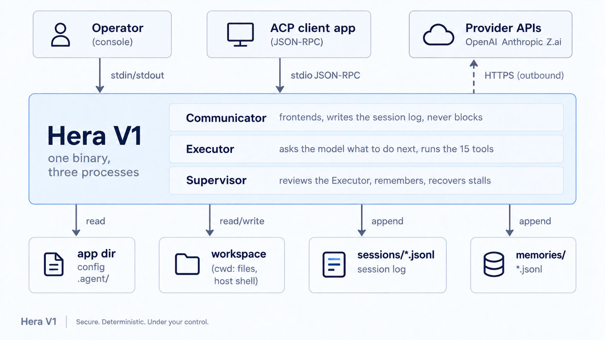
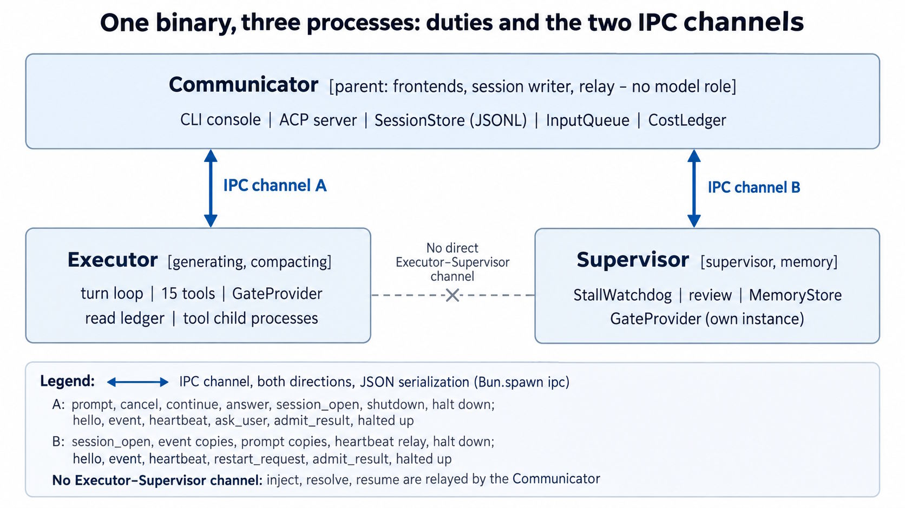
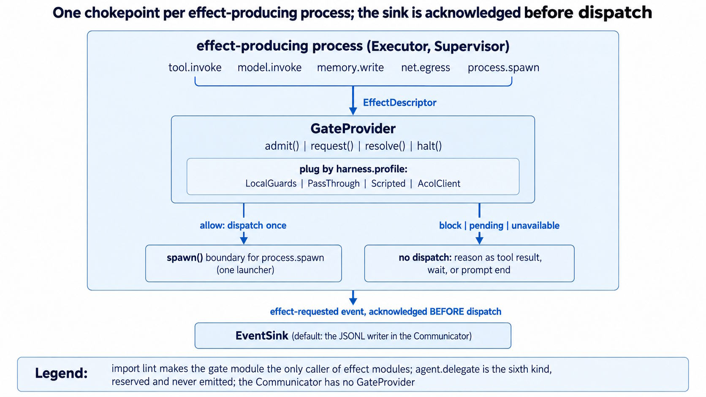
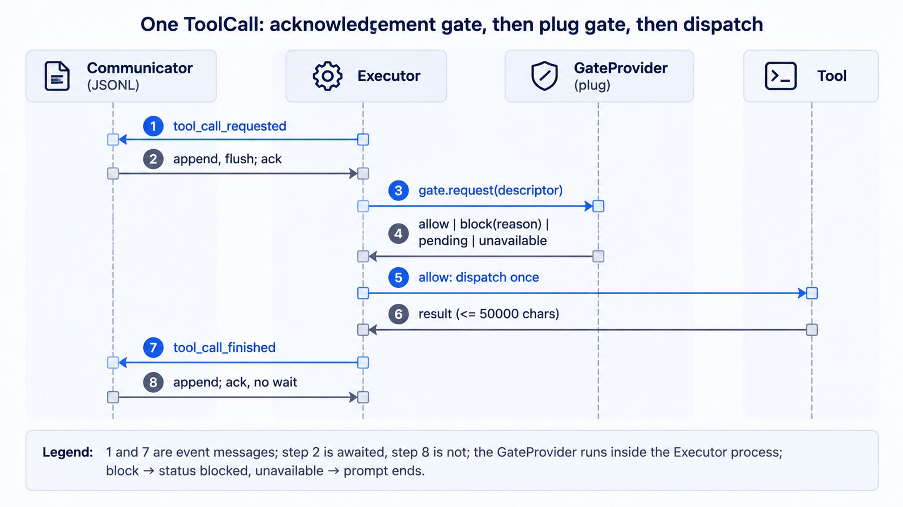
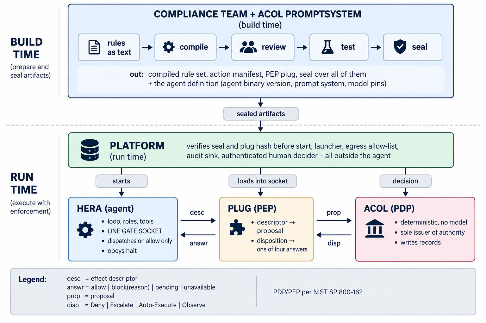
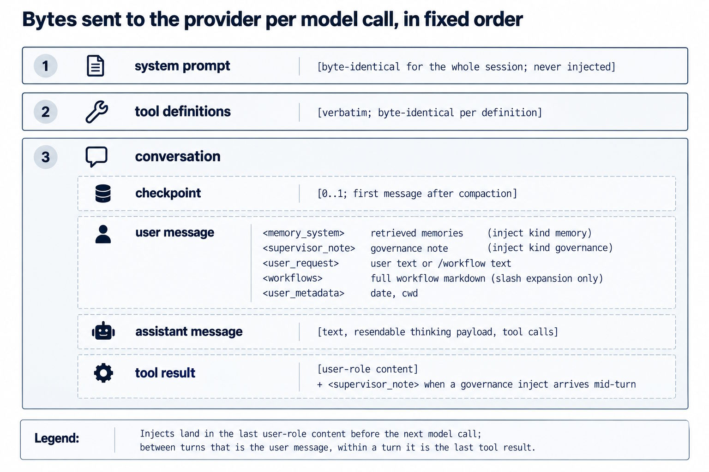

# Hera V1

Hera is an AI agent for knowledge work on files, code, and documents, designed to run as a backend component inside a corporate environment - on virtual machines and servers the organization controls, not on end-user devices. It ships as one self-contained executable with no runtime to install, executes every action through a deterministic control layer, records every byte exchanged with the model in an append-only session log (JSON Lines, JSONL) with a single writer, and sends no telemetry. The organization owns the rules the agent follows, the log of what it did, and the policy that decides what it may do. Hera ships with IPPS (https://github.com/karstenheld3/IPPS), a production-grade prompt library optimized for enterprise document intelligence work - research, specification, transcription, translation, fact-checking, and review - that the organization can adopt as is, extend, or replace.

A task arrives in plain language - from an operator on the console, from a client application over the Agent Client Protocol (ACP), or from a scheduled job - "extract the deadlines from these contracts into a table", "check this folder against the naming policy", "run `/verify`". Hera reads, edits, searches, runs commands, and fetches web pages on that host until the task is done or a guard stops it.

## Design principles for regulated environments

- **Separation of duties in the architecture**: the process that acts (Executor) is not the process that reviews it (Supervisor) or the process that records it (Communicator). The gate in front of every tool call is code the model cannot reach or reconfigure
- **Deterministic control before probabilistic action**: every tool call passes a gate with a fixed verdict (`allow`, `block`, `pending`, `unavailable`) before anything executes. Guards are rules, not model judgement
- **Full-recall audit trail**: the session log alone reconstructs every byte sent to any model - system prompt, tool definitions, conversation, injected memories, governance notes. Nothing needs to be requested from a vendor
- **Data flows you can enumerate**: outbound traffic is limited to the configured model provider (OpenAI, Anthropic, or Z.ai) and URLs the model explicitly fetches. No telemetry, no usage analytics, no vendor callbacks
- **Compliance ownership stays with the organization**: behavior is defined by a Markdown prompt system (rules, workflows, skills) the organization authors and versions; policy enforcement is a plug in a gate socket, selected by profile - the `governed` profile hosts the plug of an external Adaptive Compliance Layer (ACOL), which then decides while Hera only proposes and obeys
- **Zero-install, single artifact**: one Windows executable (Authenticode signing at build time) with pinned runtime, bundled prompt system, and checksums. Rollout to a VM image or server follows the same change process as any other binary; the app directory next to it holds all state and can be backed up or wiped as a unit

## Deployment scenarios

- **Backend agent behind a client application**: a service or IDE-style frontend that speaks ACP spawns `hera --acp` on the server and exchanges JSON-RPC over stdio; the frontend never touches the host, the model provider, or the API keys. Guards, log, and cost tracking apply to every session
- **Unattended batch processing**: a scheduler or continuous integration (CI) runner calls `hera -p "..."` for one task or `hera --prompt-file` for a reviewed queue of tasks in one session; the exit code reports the outcome; human approval steps are denied by default (`--approve-all` opts out where policy allows)
- **Operator console**: an administrator opens a shell on the VM (or via SSH), starts `hera` in a workspace folder, and works interactively - for setup, diagnosis, and reviewing sessions with `--resume`

In all three, the workspace is the current working directory at launch; the workspace boundary confines writes to it, and one VM can host several isolated app directories with separate configurations, prompt systems, and logs.

## Architecture



One `hera.exe` starts three cooperating operating-system processes with distinct duties:

- **Communicator** (parent) - the only process that reads client or console input, writes output, or appends to the session log. It never waits on a model call, so `/status`, `/cost`, and cancellation always respond. It relays inter-process communication (IPC) messages between the two children; they have no direct channel to each other
- **Executor** - runs the *turn loop*: send the conversation to the model, execute the tool calls it requests, append the results, repeat until the model answers without tools. Owns all tool child processes (shell commands) and terminates them on cancel or shutdown
- **Supervisor** - runs outside the code it reviews: checks recent tool calls against the loaded rules asynchronously and injects a governance note when a pattern violates one, extracts and retrieves memories, raises cost alerts, detects a stalled or hung Executor and resumes or restarts it within a bounded restart budget



Model roles are fixed per process (`generating` and `compacting` in the Executor, `supervisor` and `memory` in the Supervisor, none in the Communicator); every model call is attributed to one role in the cost ledger.

**Resilience**: an Executor crash loses at most the turn in flight - the Communicator restarts it and replays the session log. If Hera itself is terminated, `hera --resume` restores the conversation from the log. API keys never cross the process boundary and are stripped from the environment of tool child processes.

### Control layer: gate, plug, sink

Every effect - tool call, model call, memory write, outbound request, process spawn - is described by an immutable effect descriptor and passes one gate per effect-producing process. The plug inside the gate answers `allow`, `block(reason)`, `pending`, or `unavailable`; only `allow` dispatches, exactly once. The deterministic guards (denylist, shell-wrapper detection, workspace boundary, protected paths, key-shape scan) are the content of the shipped `local` plug; a `block` is recorded as a Supervisor intervention event. No timeout ever converts silence into `allow`.



This is the harness interface an external compliance layer needs from an agent: one gate, one descriptor shape, four answers, admission and halt inputs, an origin tag per context segment, events acknowledged before effects, one definition hash, one spawn boundary. Under the `governed` profile the ACOL plug fills the socket and becomes the Policy Decision Point; Hera's obligation is that no effect bypasses the socket and every answer is obeyed.

The log line exists before the side effect. For one tool call:



### Adaptive Compliance Layer (ACOL)

**What it is.** ACOL is a deterministic compliance layer for agents in regulated institutions. It compiles the institution's written rules - regulation, internal policy, granted authority - into enforceable controls, seals the reviewed result together with the agent definition, and at run time answers every proposed agent effect with one of four dispositions: Deny, Escalate, Auto-Execute, or Observe. Every decision is recorded tamper-evidently. ACOL is not a model, not the agent, and not a prompt: it is code at a chokepoint that the model cannot persuade, that sees every effect, and whose decision is written down before the effect happens.

**Why it exists.** An agent is a program whose next instruction is written by a model, from inputs nobody in the institution wrote. Prompts and model weights cannot be the control: a prompt is advice to a component that is persuadable by its own inputs, and weights encode tendencies, not guarantees. Regulators expect proposal-execution separation, per-action dispositions, a human in the loop with substance, a kill switch, a decision trace, and a tamper-evident log. ACOL supplies these once, for every agent on the platform, so that compliance is solved per platform rather than per application. The intended division of labor: the compliance team steers (writes and approves the rules), builders build (agents and workflows), users use.

**How it relates to Hera.** ACOL is the Policy Decision Point; Hera is the agent that hosts the Policy Enforcement Point. Hera never computes a disposition. Its whole obligation is the harness described above: one gate socket that every effect passes, one descriptor shape, four answers obeyed literally, admission before the first effect, a halt input, an origin tag on every context segment, events acknowledged before effects, one definition hash, one spawn boundary. ACOL supplies the **plug** that fills the socket. The plug enriches Hera's effect descriptors into proposals, obtains dispositions from the decision point, and maps them back: Deny → `block(reason)`, Escalate → `pending`, Auto-Execute → `allow`, Observe → `allow` plus a review record. Hera sees the four answers and nothing else - no rule text, no trust levels, no tokens, no budgets.



**What changes for a Hera deployment under `governed`.**

- Startup refuses unless the sealed plug is present and its hash matches; the profile cannot be downgraded silently, and a profile change since the previous session is announced
- Every effect - tool call, model call, memory write, web fetch, process spawn - becomes a proposal ACOL decides; the shipped `local` guards are replaced by the institution's compiled rules
- Human approval leaves the chat: an Escalate is a `pending` that only ACOL's escalation channel can resolve, through the platform's authenticated decider, with a decision format and a deadline. No keystroke in Hera's console or client application can approve a governed effect
- Halt arrives from ACOL as well as from the operator: kill switch, seal revoked, budget exhausted, hard constraint - Hera stops in-flight work, reports statuses, and stays in a terminal state until a new admission
- The event sink adapter forwards Hera's native events to ACOL's audit records, so the institution holds one decision trace across all its agents; Hera's own session log stays as the full-recall record of what was sent to the model
- Deployment form is the platform's choice: the plug runs inside the Hera process (default) or as a sidecar with its own transport; Hera offers the same in-process socket either way

**What stays the same.** Hera's architecture, tools, prompt system, frontends, and session log are unchanged. ACOL governs effects, not cognition: planning, drafting, and messages between Hera's roles inside a run are free and logged. The `local` profile is the ungoverned form for trusted workspaces; `governed` is the form for regulated ones.

## Capabilities

### Tools (15)

The model never touches the machine directly; it requests one of these, the gate answers, and Hera performs it:

```
15 tools, the descriptor kinds they carry, and where the local guards apply

Tool                            Effect kind(s)              Note
Tool catalog  [admit() exposure list may hide entries]
├─ File reading
│  ├─ read_file                 tool.invoke                 refuses image files
│  ├─ list_dir                  tool.invoke
│  └─ search                    tool.invoke                 rg.exe via spawn wrapper
├─ File editing                                             guard: workspace_boundary
│  ├─ edit                      tool.invoke                 read ledger gate
│  ├─ multi_edit                tool.invoke                 read ledger gate
│  └─ write_to_file             tool.invoke                 fails on existing file
├─ Execution                                                guards: denylist, shell_wrapper
│  ├─ run_command               tool.invoke + process.spawn host shell; child registered
│  └─ command_status            tool.invoke + process.spawn poll registered child
├─ Web research
│  ├─ search_web                tool.invoke + net.egress    provider web search side call
│  ├─ read_url_content          tool.invoke + net.egress    plain HTTP GET, chunked
│  └─ view_content_chunk        tool.invoke                 chunk by document_id
├─ Session history
│  └─ trajectory_search         tool.invoke                 own session JSONL, run_ctx scope
├─ State
│  └─ todo_list                 tool.invoke                 full replace; feeds compaction
├─ Prompt system
│  └─ skill                     tool.invoke                 SKILL.md body + file listing
└─ Interaction
   └─ ask_user_question         tool.invoke                 ask_user / answer round trip

Legend: every tool passes the gate; guards apply to run_command and the three write tools,
all other tools receive allow from LocalGuards; net.egress target = host
```

The read ledger enforces that a file is read before it is edited and re-read after an external change; `run_command` runs PowerShell on Windows with an explicit working directory.

Tool names, descriptions, and parameter schemas match the Windsurf tool set, so prompt systems written for that environment run without changes (workflow steps that need Model Context Protocol (MCP) browser tools cannot run).

### Prompt system: the organization's rulebook

Hera loads a configurable folder (default `.agent/` next to the executable) that the organization authors, reviews, and versions like any other policy artifact:

- `rules/*.md` - always-on instructions, injected into the system prompt as `<MEMORY[filename]>` blocks
- `workflows/*.md` - step lists invoked as `/name` (for example `/verify`, `/commit`); the file content is inserted into the user message
- `skills/*/SKILL.md` - larger capability bundles the model loads via the `skill` tool when relevant

The system prompt is byte-identical for a whole session; memories, workflow text, and Supervisor notes enter the user message only. This keeps the provider's prompt cache warm and makes the system prompt a fixed, reviewable artifact per session. What leaves the host per model call, in fixed order:



### Shipped prompt library: IPPS

The binary embeds IPPS (https://github.com/karstenheld3/IPPS) as the default `.agent/` folder: 8 rules, 50 workflows, 26 skills, about 320 files. IPPS is a prompt system for knowledge work on documents - reading, researching, specifying, transcribing, translating, reviewing, and maintaining Markdown artifacts - written so that an agent produces the same quality without a human watching each step. It was developed on Windsurf and runs unchanged on Hera because the tool names and memory block format are identical.

What IPPS is made of:

- **Rules** (`rules/*.md`, always on) - writing conventions, agent behavior, document ID system, core definitions. Loaded into the system prompt for every session, so every task starts from the same standards
- **Workflows** (`workflows/*.md`, invoked as `/name`) - step-by-step procedures with gates, for example `/deep-research`, `/write-spec`, `/verify`, `/fact-check`, `/critique`, `/improve`, `/reconcile`, `/implement`, `/drift-detect`, `/transcribe`, `/translate`, `/session-new`, `/commit`
- **Skills** (`skills/*/SKILL.md` plus supporting files, loaded on demand) - domain packages: `write-documents` (templates and rules for INFO, SPEC, IMPL, TEST documents), `deep-research` (source tiers, research strategies, quality pipeline), `pdf-tools`, `llm-transcription`, `coding-conventions`, `session-management`, `git`, and others

Agentic concepts in IPPS that matter for a governed deployment:

- **Audit trail in the artifacts themselves** - every document carries a Doc ID from a workspace `ID-REGISTRY.md`, a header block naming its goal and dependencies, and a reverse-chronological Document History; every finding, requirement, and decision has a stable ID (`FR-01`, `DD-03`, `PR-0001`) so a change can be traced from spec to implementation to test. Combined with Hera's session log, this yields two independent records: what the agent did (log) and what it produced and why (documents)
- **Verification labels** - claims are tagged `[ASSUMED]`, `[VERIFIED]`, `[TESTED]`, or `[PROVEN]` and may only move forward along that chain with evidence. A reader sees at every sentence how much to trust it
- **Judge and fixer separated** - `/fact-check` and `/critique` produce a `_REVIEW.md` and never modify the original; `/reconcile` weighs findings pragmatically; `/implement` applies only approved ones. No single step can both find and silently fix a problem
- **Factuality by trust hierarchy** - `/fact-check` verifies sources before facts and facts before conclusions, ranking evidence as observed behavior > source code > official documentation > community sources > model output; a failed source weakens every claim that cites it. Unfalsifiable statements are flagged, never graded
- **Rule conformity** - `/verify` rebuilds its checklist from the rule files on every run (never from memory) and applies fixes; `/critique` hunts flawed assumptions and hidden risks; `/improve` changes exactly one thing per run, backs up the original as `_vN`, and must prove the change is justified before applying it
- **Drift control** - `/drift-detect` builds a definition of done from the instructions that were given, scores the output against it, and persists every gap; `/drift-correct` closes them in a separate pass, so detection is never shortened to save effort for fixing
- **MUST-NOT-FORGET** - each plan and workflow carries a short list of the constraints most likely to be dropped under long context; the agent re-checks it before declaring a task done
- **Session discipline** - work happens in dated session folders with `NOTES.md`, `PROGRESS.md`, `PROBLEMS.md`, and a workspace-level `FAILS.md` of lessons learned that the agent must read before acting. Failures are appended, never deleted
- **Privacy gate** - before every write, general-purpose documents and illustrative examples must use generic data; real identifiers belong only in project-specific records
- **Precision conventions** - APAPALAN (as precise as possible, as little as necessary) and MECT (minimal explicit consistent terminology) govern all text, so two agents or two sessions produce comparable output

An organization keeps the parts it needs, adds its own rules and workflows in the same format, and versions the folder like any other policy artifact. Hera loads whatever the folder contains at startup and reports the counts in its banner.

### Governance and audit

- **Session log**: one JSONL file per session under `.agent-data/sessions/`, written by the Communicator only. Its first line records the full system prompt, tool definitions, resolved configuration, and a definition hash; every later line is one timestamped event with producing process, run context, and sequence number. Never auto-deleted
- **Origin tagging**: every message segment, tool result, memory line, and injected block carries its origin (`user`, `tool`, `model`, `memory`, `file`, `web`, `system`)
- **Memory integrity**: persisted memories carry an HMAC-SHA256 tag; lines that fail the check are dropped with a warning
- **Supervisor interventions** are events in the log: guard blocks, stall recoveries, governance notes, cost alerts
- **Cost accounting**: per-turn line (`Turn: in=21050 (cache 18200) out=412 | $0.0164 | session $0.0164`) and `/cost` per model role, rebuilt from the log on resume
- **Debug traffic**: `--debug` writes full request and response JSON (keys redacted) to `.agent-data/logs/`

## Deployment and operations

1. Place `hera.exe` in its own folder on the VM or server. On first start Hera creates `.agent/`, `.agent-tools/`, and `.agent-data/` (including `.agent-data/config/`) next to it; nothing is written elsewhere (layout below)
2. Provide at least one API key in the service account's environment: `OPENAI_API_KEY`, `ANTHROPIC_API_KEY`, or `ZAI_API_KEY`. The file fallback `.agent-data/config/.api-keys.txt` can be disabled with `keys.allow_file: false`
3. Select models per role in `.agent-data/config/agent-config.json` (`generating` is required; a missing `compacting`, `supervisor`, or `memory` role gets a built-in default and one `NOTICE:` line at startup). Models must exist and be enabled in the shipped `model-registry.json` - a model inventory the organization can restrict
4. Run `hera selftest offline` to verify the installation without a model call, then start `hera` (console), `hera --acp` (backend for a client application), or `hera -p` / `--prompt-file` (batch) with the workspace folder as current directory

```
<app_dir>/                          next to the binary
├─ hera.exe                         overwrite to update; app_dir stays untouched
├─ .agent/                          agent_folder default: prompt library
│  ├─ rules/
│  ├─ workflows/
│  └─ skills/
├─ .agent-tools/
│  └─ rg.exe                        ripgrep 15.2.0
└─ .agent-data/                     data_dir default
   ├─ config/
   │  ├─ agent-config.json           default generated at first run; operator edits
   │  ├─ .api-keys.txt              keyless template from a code constant
   │  ├─ model-registry.json        shipped data, materialized from the payload
   │  ├─ model-parameter-mapping.json
   │  └─ model-pricing.json
   ├─ sessions/                     [YYYY-MM-DD_HHMMSS]_[id].jsonl, never auto-deleted
   ├─ memories/                     workspace-<hash>.jsonl, global.jsonl
   ├─ logs/
   └─ selftest/                     YYYY-MM-DD_HH-MM-SS/results.json

Legend: zero-setup creates every missing entry at startup, one line per created artifact;
missing model data files after materialization are a ConfigError
```

```
Usage: hera [options] | hera selftest [args]

Start:      hera | --app-dir <path> | --resume [session-file] | --config <path> | --show-thinking | --version
Debug:      --debug | --debug-console | --log-dir <path>
Headless:   -p "<prompt>" | --output-format text|jsonl | --approve-all
Queue:      --prompt-file <path>
ACP:        --acp
Selftest:   hera selftest [--menu | codes | offline | live | all] [--provider <id>] [--model <id>] [--budget <usd>]
```

Console built-ins: `/help`, `/cost`, `/status`, `/exit`, `/halt`. Ctrl+C during a turn cancels it; Ctrl+C at the idle prompt exits.

Headless exit codes: `0` completed, `2` configuration error, `3` provider failure after retries, `4` stopped without completion (cancelled, tool-call limit declined, restart budget exhausted).

`hera selftest` checks the installation without a model call (`offline`) or with a small paid probe per configured provider (`live`); results are written to `.agent-data/selftest/`.

## Development setup

Prerequisites:
- Bun 1.4+ (https://bun.com/)
- Windows x64 (the only shipped target in this version)

```
bun install
bun run src/index.ts        # run from source
bun test                    # unit + integration tests, no API keys needed
bun run lint                # type check
```

Build a distributable binary (verifies toolchain, bundles the prompt system and `rg.exe`, type-checks, compiles, smoke-tests, writes checksums):

```
build.bat
```

Output: `dist/hera-<version>-bun-windows-x64.exe` plus `SHA256SUMS.txt`. No runtime install is required on the target machine.

## Scope and known limits

Stated so that a risk assessment can rely on them:

- **Model access**: OpenAI, Anthropic, and Z.ai APIs over HTTPS are the only supported providers; there is no on-premise model runtime in this version. Data sent to the provider is governed by the organization's contract with that provider
- **Platform**: Windows x64 is the only shipped target
- **Not included**: Model Context Protocol (MCP) clients, hooks, a `code_search` subagent, feature flags
- **Prompt injection**: everything the model reads (workspace files, command output, web pages) is untrusted input. The deterministic guards stop accidental and common injected destructive commands; they are not a defense against an adversary crafting commands to evade first-token matching. Trusted workspaces are the intended operating environment; the `governed` profile exists for environments that need an external policy engine

## Security

Hera V1 gates every tool call through a harness plug selected by the `harness.profile` config key. Four profiles are available:

- **`local`** (default): `LocalGuardsPlug` enforces a denylist, shell-wrapper detection, workspace path boundary, protected paths, key-shape scanning, and an approval policy for `run_command`.
- **`passthrough`**: `PassThroughPlug` allows all effects with no guards and no approvals. Prints `WARNING: profile passthrough - no guards, no approvals` at startup. Intended for tests and equivalence runs.
- **`scripted`**: test profile that replays a recorded model script; refuses at startup unless the `HERA_SCRIPTED_ADAPTER` environment variable names the script file.
- **`governed`**: requires an ACOL plug that is not bundled in this build. Refuses at startup with `ERROR: profile 'governed' requires an ACOL plug; none is bundled in this build`.

```
harness.profile   Plug          Spawn launcher     Event sink          Status
────────────────  ────────────  ─────────────────  ──────────────────  ──────────────────
local             LocalGuards   host spawn         JSONL sink          shipped default
passthrough       PassThrough   host spawn         JSONL sink          tests, equivalence
scripted          Scripted      host spawn         JSONL sink          harness test suites
governed          AcolClient    platform launcher  ACOL sink adapter   declared only

Answers: PassThrough allow always; LocalGuards allow, block, or pending; Scripted per script;
AcolClient all four. No plug change inside an admitted run.
```

### run_command approval

Under the `local` profile, every `run_command` that is not denylisted and passes key-shape scan is evaluated by the approval policy (`harness.local.approval`):

- `unsafe` (default): `pending` (requires human approval) when `SafeToAutoRun` is not `true`, when the first token is a network command, or when `Cwd` is outside the workspace; otherwise `allow`.
- `all`: every `run_command` requires approval.
- `off`: every `run_command` that passes the denylist is allowed without approval. Prints `WARNING: approval is off - run_command is not gated` at startup.

In interactive mode the approval widget shows the command line, working directory, and reason; `y` allows, `n` or Escape denies. In pipe mode the console prints `Approve run_command: <summary>? [y/n]` and reads the next input line.

The `--approve-all` flag (headless and prompt-queue modes only) answers `allow` on every pending approval instead of the default `deny`.

### Protected paths

`harness.local.protected_paths` (default: `.api-keys.txt`, `agent-config.json`, `memory.secret`, `~/.ssh`, `~/.aws`, `~/.azure`, `~/.gnupg`, `**/.env*`, `**/*.pem`, `**/id_rsa*`) blocks both read and write tools even inside the workspace or allowlist. The allowlist never overrides protected paths.

### read_allowlist

`harness.local.read_allowlist` (default `[]`) names paths outside the workspace that read tools (`read_file`, `list_dir`, `search`) may touch. Write tools never use the allowlist.

### Key sources

API keys are resolved from environment variables first (`OPENAI_API_KEY`, `ANTHROPIC_API_KEY`, `ZAI_API_KEY`), then from `.agent-data/config/.api-keys.txt`. When any key is file-sourced, startup prints `WARNING: <n> key(s) loaded from .api-keys.txt - prefer environment variables`. The config key `keys.allow_file` (default `true`) disables file-sourced keys entirely when set to `false`.

### Memory integrity

Each memory line carries an HMAC-SHA256 `mac` field keyed by a 32-byte random secret in `<app dir>/memory.secret`. The loader drops lines with a missing or wrong `mac` and emits one `WARNING: <n> memory lines failed integrity check and were skipped`. Legacy lines without `mac` are tagged once by a migration step.

## Security foundations and standards alignment

Hera holds no certification (no ISO/IEC 27001, SOC 2, or Common Criteria evaluation). Its control architecture implements the following published principles and contracts; each row names the Hera mechanism that realizes it.

### Design references implemented

- **Reference monitor** (Anderson, 1972: always invoked, tamper-proof, small enough to verify) - the gate is the only code path to tool dispatch, model invocation, memory write, web egress, and process spawn; a build-time import lint (`scripts/lint_harness.ts`) fails the build if any module calls an effect directly
- **Complete mediation and fail-safe defaults** (Saltzer and Schroeder, 1975) - every effect, including reads, passes the gate; `unavailable` dispatches nothing and ends the prompt; no timeout converts silence into `allow`; headless mode answers `pending` with `deny`
- **Least privilege** (Saltzer and Schroeder) - workspace write boundary, read boundary with explicit `read_allowlist`, protected credential paths, tool child processes started without provider credentials, `admit()` exposure list that can hide tools per run
- **Policy Decision Point / Policy Enforcement Point separation** (NIST SP 800-162) - Hera hosts the enforcement socket; the plug decides; under `governed` an external ACOL instance is the decision point and Hera never computes a disposition
- **Per-step authority and four dispositions** (MAS Safeguards for Agentic Finance at Runtime, 2026) - one answer per effect descriptor, never carried to the next; a retry is a new descriptor; `block(reason)` is rendered to the model as the tool result; a human decision is keyed to the `effect_id` it answers
- **Integrity of persisted state** - HMAC-SHA256 over every memory line with a key that tools cannot read (`memory.secret` is a protected path); tampered or unkeyed lines are dropped and reported
- **Threat taxonomy** (MITRE ATLAS) - prompt injection (AML.T0051) is treated as the primary initial-access vector: tool results and web content are wrapped as untrusted content with an origin tag, the system prompt instructs the model to treat them as data, and no text in the model's channel can authorize an effect

### Adaptive Compliance Layer (ACOL) harness conformance

The Adaptive Compliance Layer contract defines the harness properties an agent must prove against a scripted plug. Hera's harness test suite (`tests/integration/harness_conformance.test.ts`, `tests/integration/harness_faults.test.ts`, `tests/unit/harness_gate.test.ts`) proves the following properties and runs as part of `bun test`:

- **Complete mediation** - no effect bypasses the gate; a direct call fails at run time and the build-time lint reports it
- **Single dispatch** - one answered descriptor produces at most one dispatch, across processes and restarts; the dispatched effect equals the answered descriptor
- **Fail-closed** - `unavailable` yields zero effects and ends the prompt; `pending` waits with heartbeats and no chat text is ever taken as a decision; an effect interrupted by a crash is closed as `unknown` and never re-dispatched
- **Halt** - acknowledged within the deadline with in-flight statuses; the run enters a terminal state until a new admission
- **Sealed definition** - the definition hash is stable across processes and resume and changes on any sealed input; a governed deployment cannot start downgraded, and a configuration change since the previous session is announced
- **Event ordering** - the effect-requested event is acknowledged by the log before dispatch, for every effect kind
- **Isolation** - one spawn boundary, no code evaluation from data, no secret in any event, descriptor, or model context
- **Persisted-state integrity** - a tampered persisted record never reaches the model

Delegation to sub-agents is reserved in the contract and not implemented (`agent.delegate` is never emitted).

### Built-in controls

Seven deterministic controls in the shipped `local` plug cover the common attack paths against a tool-using agent. Each is a rule, not a model judgement, and `hera selftest 10` verifies all seven offline without a model call:

- **Command approval** - every `run_command` is held for human approval unless the model marked it safe, it is not a network command, and it runs inside the workspace; denylisted and shell-wrapped commands are blocked outright
- **Untrusted-content separation** - tool results, web content, and retrieved memories are delimited and origin-tagged; the system prompt instructs the model that nothing inside these delimiters is an instruction
- **Credential isolation** - key files and other secret-bearing paths are unreadable by every tool; keys can be restricted to environment variables; tool child processes receive an environment without provider credentials
- **Egress inspection** - URLs, search queries, and command lines are scanned for secret-shaped content before dispatch and blocked when found
- **Memory integrity** - every persisted memory line carries an HMAC-SHA256 tag keyed by a secret that tools cannot read; tampered lines never reach the model
- **Profile integrity** - one plug factory; a `governed` deployment refuses to start without its plug, `passthrough` announces itself at every start, and a profile change since the previous session is printed
- **Read boundary** - read tools are confined to the workspace plus an explicit `read_allowlist`; write tools never leave the workspace

### Not claimed

- Regulatory mappings (EU AI Act, DORA, MaRisk, BaFin Three Lines of Defense, MAS SAFR) are properties of an ACOL deployment on top of Hera's harness, not of Hera alone
- Encryption of the key file at rest (no platform key store is used; environment variables are the recommended source)
- Hash-chained, externally anchored audit records - the session log is append-only with one writer; chaining is the ACOL sink adapter's role under `governed`
- Resistance to an adversary who crafts commands to evade first-token denylist matching (stated in Scope and known limits)

## Further reading

- Shipped prompt library: https://github.com/karstenheld3/IPPS
- Test suite layout and how to run it: `tests/README.md`
- Configuration keys: `.agent-data/config/agent-config.json` is generated with defaults on first start; `hera --help` lists all flags
